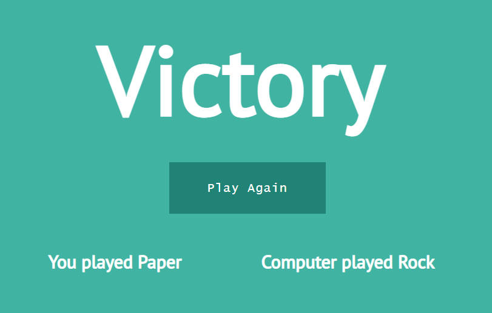

# Simple Rock Paper Scissors - JavaScript

Self revising certain concepts of JS as part of #100daysofcoding

## Tech:

> Basic HTML,CSS & JS .

## About the game:

You & Computer will guess a weapon to see who wins!
If defeated no problem, Play Again!!!

> Check out the game [Link](https://shijoshaji.github.io/simple-Rockpaper/)

## Screen Shot:

